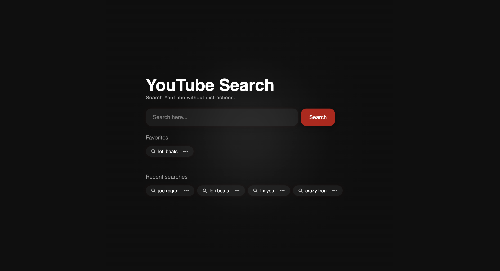

# YT Search - Distraction-Free YouTube Search

A minimalist web application that allows you to search YouTube without being distracted by recommendations or other attention-grabbing elements.

## Features

- **Clean Interface**: Minimal design focused solely on search
- **Search History**: Automatically saves your recent searches
- **Favorites**: Save frequent searches for easy access
- **Dark Mode Support**: Automatically adapts to your system preferences
- **Zero Tracking**: No analytics or tracking - just search

## Technology Stack

- **Astro**: Fast, lightweight web framework
- **React**: Interactive UI components
- **CSS Modules**: Scoped styling
- **LocalStorage API**: Client-side data persistence

## Getting Started

### Prerequisites

- Node.js (v16 or later)
- Yarn or npm

### Installation

1. Install dependencies:
   ```bash
   yarn install
   ```

2. Start the development server:
   ```bash
   yarn dev
   ```

3. Open your browser and navigate to `http://localhost:4321`

## Commands

| Command              | Action                                      |
| :------------------- | :------------------------------------------ |
| `yarn install`       | Installs dependencies                       |
| `yarn dev`           | Starts local dev server at `localhost:4321` |
| `yarn build`         | Build your production site to `./dist/`     |
| `yarn preview`       | Preview your build locally                  |

## Privacy

- All data is stored locally in your browser via localStorage
- No data is sent to any server (except the search query to YouTube)
- No cookies or tracking scripts are used

## License

This project is licensed under the MIT License.